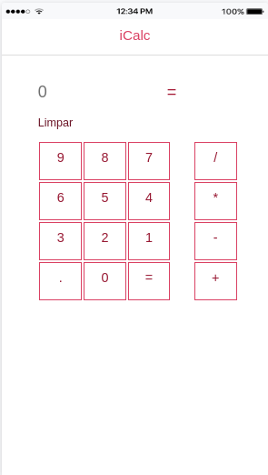

# iCALC

O iCALC é uma calculadora construida em Ionic/V1 e AngularJS.

## Instalação

1. Clone o repositório: git@github.com:alexandrejuk/iCalc.git
2. Depois acesse o diretório: cd iCalc
3. Instalar os packages necessários: npm install
4. Executar o projeto: ionic serve --lab
5. Abrir o browser: http://localhost:8100

# Screenshot

   
# Author
[Alexandre dos Santos Soares](https://github.com/alexandrejuk)

